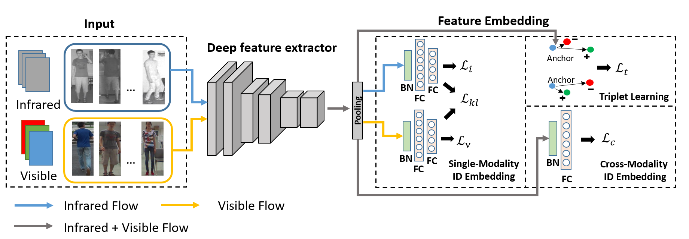

# Cross-Modality Infrared-Visible Re-ID
Pytorch Code for Cross-Modality Infrared-Visible Person Re-identification (IV-REID). Our code modified from the [reid-strong-baseline](https://github.com/michuanhaohao/reid-strong-baseline). The framework architecture is illustrated as the follow figure.


## Results (rank1/mAP)
| Dataset   | Rank@1 | Rank@10 | Rank@20 | mAP  |
| --------- | ------ | ------- | ------- | ---- |
| RegDB[1]  | 46.8   | 69.2    | 78.3    | 43.7 |
| SYSUMM[2] | 46.3   | 84.6    | 92.3    | 44.2 |

## Get Started
1. Install dependencies:
  - pytorch>=0.4
  - torchvision
  - numpy
2. Prepare Dataset and pretrained model:

Remember to set your path to the root of the dataset in `data/sysumm.py` and `data/regdb.py` and pretrained model path in config file option `PRETRAIN_PATH`. Download datasets can refer to [here](https://github.com/mangye16/Cross-Modal-Re-ID-baseline#1-prepare-the-datasets)
3. Train

  Due to the different evaluation strategy, we offer two train code for different datasets.

  For RegDB dataset:
  ```bash
  python ./train_regdb.py --config ./configs/res50_regdb_all.ini
  ```
  For SYSU-MM dataset:
  ```bash
  python ./train_sysumm.py --config ./configs/res50_sysumm_all.ini
  ```

4. Test

  For RegDB dataset( Notice the trial n  must match the trial used for training):
  ```bash
  python ./test.py --config ./configs/res50_regdb_all.ini --model_path /path/to/model --trial n
  ```
  For SYSU-MM dataset:
  ```bash
  python ./test.py --config ./configs/res50_sysumm_all.ini --model_path /path/to/model
  ```

## Pretrain model
  - [RegDB](https://drive.google.com/open?id=1jaHlE2h0E1GGb4G8MkSxv5pphN7yTUl7)
  - [SYSU-MM](https://drive.google.com/open?id=1-R-Vc8IF0xzfV_mUooowyJ38VuADDah4)

## Tips
  - In SYSU-MM dataset the gallery are generated randomly followed the protocol in [2], hence the result may a bit different from our reported result depends on the random seed.
  - The hyper-parameter are sensitive for IV-REID, so be careful for the choice of hyper-parameter.
  - During the training, the performance may fluctuate dramatically.

## Reference

[1] D. T. Nguyen, H. G. Hong, K. W. Kim, and K. R. Park. Person recognition system based on a combination of body images from visible light and thermal cameras. Sensors, 17(3):605, 2017.

[2] A. Wu, W.-s. Zheng, H.-X. Yu, S. Gong, and J. Lai. Rgb-infrared crossmodality person re-identification. In IEEE International Conference on Computer Vision (ICCV), pages 5380–5389, 2017.

[3] M. Ye, Z. Wang, X. Lan, and P. C. Yuen. Visible thermal person reidentification via dual-constrained top-ranking. In International Joint Conference on Artificial Intelligence (IJCAI), pages 1092–1099, 2018.